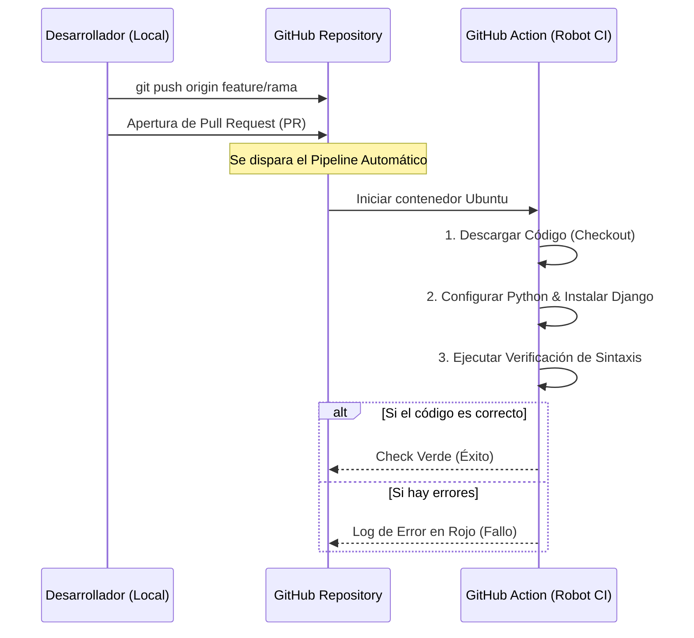
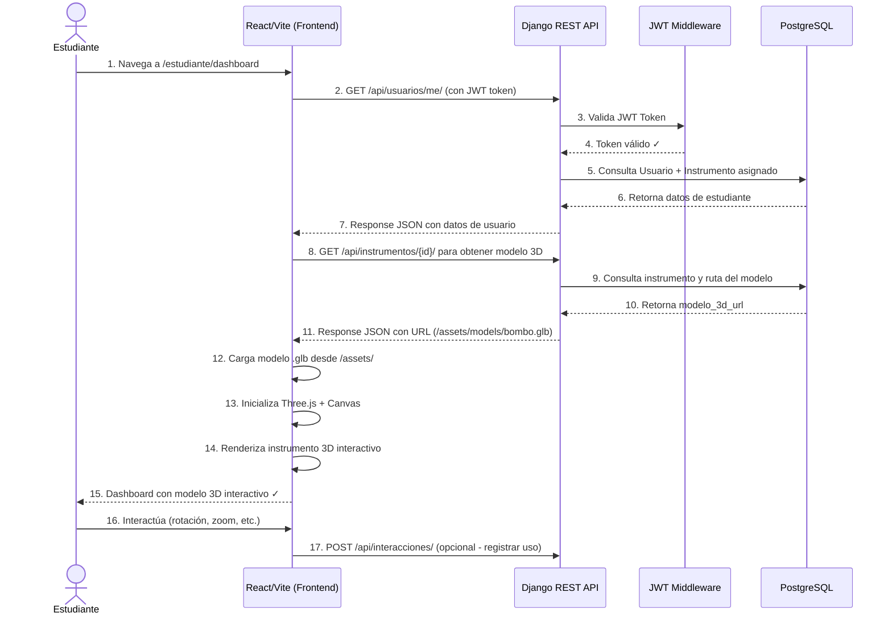
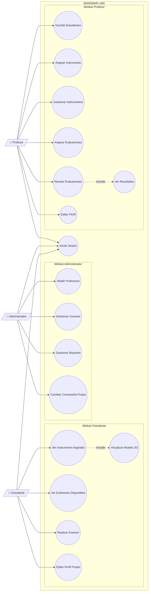
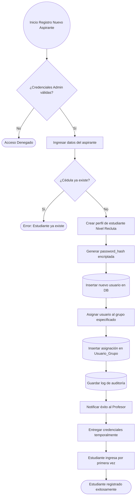
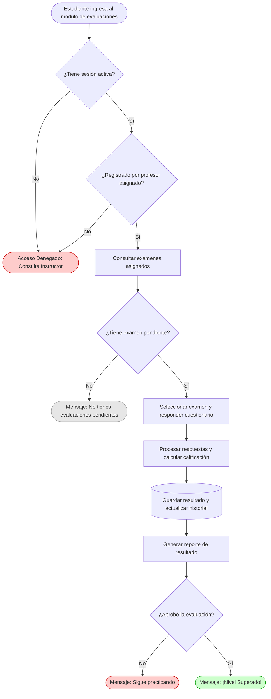
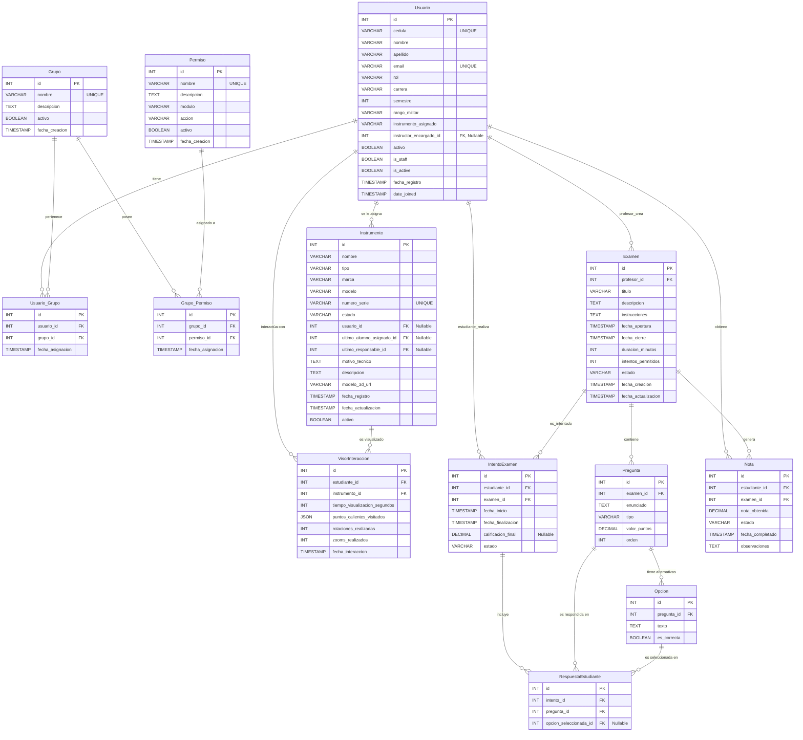

# Bandwar SGA - Sistema de Gestión de Aprendizaje enfocado en la banda de guerra de la UNEFA

Este es el repositorio central del prototipo **Bandwar SGA**, desarrollado como solución tecnológica integral para la automatización, control de inventario y gestión del conocimiento de la banda de guerra de la UNEFA-Falcon.

---
## 🎥 Demostración del Proyecto (Fase 2)

[](https://youtu.be/NC2ADuhLshc)

*Haz clic en la imagen para ver el video de inicialización, automatización y paridad de entornos en YouTube.*

---
##  Arquitectura del Sistema (Doc-as-Code)

De acuerdo con los lineamientos técnicos establecidos en la Fase #2, la arquitectura estructural y el flujo de datos del sistema se encuentran modelados directamente en código utilizando **Mermaid.js**.

### Aclaración de arquitectura para los modelos 3D
Para este prototipo, los modelos 3D (.glb) son recursos visuales estáticos y no forman parte de la lógica de evaluación ni del cálculo de calificaciones. Su función es únicamente mostrar de forma interactiva el instrumento asignado al estudiante dentro del visor 3D del sistema.

- Los archivos .glb se almacenan físicamente en la carpeta `frontend/public/assets/models`.
- El frontend los consume como archivos estáticos y los renderiza en el navegador mediante React + Three.js.
- El backend sigue encargándose de usuarios, instrumentos, exámenes, respuestas y resultados en PostgreSQL.
- Los modelos 3D no se usan para validar exámenes ni para determinar si una respuesta es correcta.

##  Instrucciones de Instalación y Despliegue Local

Para garantizar la paridad de entornos y que el sistema pueda ejecutarse en cualquier máquina de desarrollo de forma limpia, siga los siguientes pasos:

### 1. Prerrequisitos
Asegúrese de tener instalado en su sistema:
* Python 3.10 o superior
* PostgreSQL 14 o superior (corriendo en el puerto 5432)

### 2. Clonar el Repositorio y Ramas
Clone el proyecto y muévase a la rama de integración:
```bash
git clone [https://github.com/isaacoronam/bandwar-sga.git](https://github.com/isaacoronam/bandwar-sga.git)
cd bandwar-sga
git checkout develop
```
### 3. Configuración del Entorno Virtual (Windows)
Cree y active el entorno virtual para aislar las dependencias:
```bash
python -m venv venv
.\venv\Scripts\Activate
```
### 4. Instalación de Dependencias
Instale los paquetes requeridos por el proyecto:
```bash
pip install -r requirements.txt
```
### 5.Variables de Entorno (.env)
Cree un archivo llamado `.env` en la carpeta `backend/` (este archivo está protegido por .gitignore) y configure sus credenciales de base de datos local:
```bash
# Backend - Django
DJANGO_SECRET_KEY=django-insecure-tu-llave-secreta-aqui
DJANGO_DEBUG=True
DJANGO_ALLOWED_HOSTS=localhost,127.0.0.1

# Base de Datos PostgreSQL
DB_NAME=bandwar_db
DB_USER=tu_usuario_postgres
DB_PASSWORD=tu_contraseña_postgres
DB_HOST=localhost
DB_PORT=5432
```

**Nota importante**: El archivo `.env.example` contiene variables de referencia. Nunca comitee archivos `.env` con credenciales reales.
### 6. Base de Datos y Migraciones (Backend)
Cree la base de datos en PostgreSQL con el nombre especificado en `.env`, luego ejecute las migraciones del sistema:
```bash
# Desde el directorio raíz del proyecto
cd backend

# Ejecutar migraciones
python manage.py migrate

# (Opcional) Crear superusuario para el admin de Django
python manage.py createsuperuser
```

### 7. Instalación de Dependencias del Frontend
En una nueva terminal, instale las dependencias del frontend:
```bash
cd frontend
npm install
```

### 8. Ejecución Local del Sistema Completo

**Terminal 1 - Backend (Django Server)**:
```bash
cd backend
python manage.py runserver
# El backend estará disponible en http://localhost:8000
```

**Terminal 2 - Frontend (Vite Dev Server)**:
```bash
cd frontend
npm run dev
# El frontend estará disponible en http://localhost:5173
```

El sistema está listo. Acceda a `http://localhost:5173` en su navegador.

### 1. Diagrama de Bloques y Flujo de Datos

```mermaid
graph TD
    subgraph Cliente [Cliente Navegador Web]
        React["⚛️ React 19.2.6"]
        Router["🛣️ React Router v7"]
        Three["📦 Three.js & Drei (3D)"]
        Bootstrap["🎨 Bootstrap 5"]
        Axios["📡 Axios HTTP Client"]
    end

    subgraph Backend [Servidor Django REST Framework]
        DRF["🔌 Django REST API"]
        Auth["🔐 Autenticación JWT"]
        ORM["📊 ORM Django"]
        Views["👁️ Vistas REST"]
    end

    subgraph Persistencia [Capa de Datos]
        Postgres[("🐘 PostgreSQL 14+")]
        Static["📁 Assets Estáticos (.glb)"]
    end

    React --> Axios
    Router --> React
    Three --> React
    Bootstrap --> React

    Axios -->|HTTP/JSON| DRF
    DRF --> Auth
    DRF --> Views
    Views --> ORM

    ORM -->|SQL| Postgres
    Static -->|GET| React

    Auth -.->|JWT Token Validation| ORM

    style React fill:#61dafb
    style Postgres fill:#336791
    style DRF fill:#092e20
    style Three fill:#000000
```



**Componentes de la Arquitectura:**

1. **Frontend (React + Vite)**
   - React 19.2.6 para interfaz de usuario
   - Three.js para visualización 3D de instrumentos
   - React Router para navegación entre módulos
   - Bootstrap 5 para estilos consistentes
   - Axios para comunicación asíncrona con el servidor

2. **Backend (Django REST Framework)**
   - Django 6.0 como framework principal
   - Django REST Framework para APIs REST
   - JWT Simple Token para autenticación stateless
   - PostgreSQL como base de datos relacional

3. **Persistencia**
   - PostgreSQL para datos estructurados (usuarios, exámenes, evaluaciones)
   - Archivos estáticos 3D en `frontend/public/assets/models` para los modelos `.glb`
   - CORS Headers habilitado para comunicación frontend-backend

> Nota: los archivos `.glb` son activos estáticos del frontend y no participan en la lógica de evaluación; solo se usan para la experiencia visual del visor 3D.
### 2. Flujo de Control para la Integración Continua (CI)


### 3. Diagrama de Secuencia: Carga del Dashboard del Estudiante


### 4. Diagrama de casos de uso: 


### 5. Diagrama de Flujo: Registro Estudiantil 

### 6. Diagrama de Flujo: Módulo de Evaluaciones 

### 7. Diagrama Entidad-Relación (Base de Datos)


---

## 📁 Estructura del Proyecto

```
bandwar-sga/
├── backend/                          # Django REST API
│   ├── backend/                      # Configuración del proyecto Django
│   │   ├── settings.py              # Configuración principal
│   │   ├── urls.py                  # Enrutamiento principal
│   │   ├── asgi.py                  # ASGI para producción
│   │   └── wsgi.py                  # WSGI para producción
│   ├── core/                        # App principal con toda la lógica
│   │   ├── models.py                # Definición de todos los modelos
│   │   ├── views.py                 # Vistas REST API
│   │   ├── serializers.py           # Serializadores DRF
│   │   ├── urls.py                  # Rutas de core
│   │   ├── admin.py                 # Administración de Django
│   │   ├── management/commands/     # Comandos personalizados
│   │   │   ├── init_roles.py        # Inicializar roles y permisos
│   │   │   ├── seed_users.py        # Crear usuarios de prueba
│   │   │   ├── seed_test_scenario.py # Crear escenario de prueba
│   │   │   └── assign_instructors_to_students.py
│   │   └── migrations/              # Migraciones de BD
│   ├── requirements.txt             # Dependencias Python
│   ├── manage.py                    # Script de management de Django
│   └── .env                         # Variables de entorno (NO commitar)
├── frontend/                        # React + Vite
│   ├── src/
│   │   ├── App.jsx                  # Componente raíz
│   │   ├── main.jsx                 # Punto de entrada
│   │   ├── components/              # Componentes reutilizables
│   │   │   ├── 3d/                  # Componentes de visualización 3D
│   │   │   │   ├── Visor3D.jsx      # Visor 3D principal
│   │   │   │   ├── InstrumentoModel.jsx
│   │   │   │   └── VisorInstrumento.jsx
│   │   │   ├── layout/              # Componentes de layout
│   │   │   │   ├── Navbar.jsx
│   │   │   │   └── Layout.jsx
│   │   │   └── ErrorBoundary.jsx
│   │   ├── views/                   # Vistas/Páginas
│   │   │   ├── auth/                # Autenticación
│   │   │   │   └── Login.jsx
│   │   │   ├── estudiante/          # Módulo de estudiante
│   │   │   │   ├── EstudianteDashboard.jsx
│   │   │   │   ├── MisEvaluaciones.jsx
│   │   │   │   ├── TomarExamen.jsx
│   │   │   │   ├── OrdenCerrado.jsx
│   │   │   │   └── MisNotas.jsx
│   │   │   ├── profesor/            # Módulo de profesor
│   │   │   │   ├── ProfesorDashboard.jsx
│   │   │   │   ├── GestionInstrumentos.jsx
│   │   │   │   ├── CrearEditarExamen.jsx
│   │   │   │   └── GestionEvaluaciones.jsx
│   │   │   └── shared/              # Vistas compartidas
│   │   │       └── Perfil.jsx
│   │   ├── context/                 # Context API
│   │   │   └── AuthContext.jsx      # Contexto de autenticación
│   │   ├── api/                     # Configuración de Axios
│   │   │   └── axiosConfig.js
│   │   ├── styles/                  # Estilos CSS
│   │   └── utils/                   # Funciones utilitarias
│   ├── public/                      # Archivos estáticos
│   │   ├── assets/models/           # Modelos 3D (.glb)
│   │   └── icons.svg
│   ├── package.json
│   ├── vite.config.js
│   └── index.html
├── CONTRIBUTING.md                  # Guía de contribución (GitFlow + Conventional Commits)
├── README.md                        # Este archivo
└── .gitignore                       # Reglas de exclusión de Git
```

---

## 🛠️ Stack Tecnológico

### Backend
| Tecnología | Versión | Propósito |
|------------|---------|----------|
| **Django** | 6.0+ | Framework web principal |
| **Django REST Framework** | Latest | API REST |
| **Django JWT Token** | Latest | Autenticación stateless |
| **PostgreSQL** | 14+ | Base de datos relacional |
| **psycopg2** | Binary | Driver PostgreSQL para Python |
| **CORS Headers** | Latest | Control de acceso entre dominios |
| **Python** | 3.10+ | Lenguaje |

### Frontend
| Tecnología | Versión | Propósito |
|------------|---------|----------|
| **React** | 19.2.6 | Framework UI |
| **React Router** | 7.15+ | Enrutamiento |
| **Three.js** | 0.184+ | Renderizado 3D |
| **@react-three/fiber** | 9.6+ | Bridge React-Three.js |
| **@react-three/drei** | 10.7+ | Utilidades para Three.js |
| **Axios** | 1.6+ | Cliente HTTP |
| **Bootstrap** | 5.3+ | Framework CSS |
| **Vite** | 8.0+ | Build tool y dev server |

---

## 🔒 Consideraciones de Seguridad

### ⚠️ Antes de Desplegar a Producción

1. **SECRET_KEY en Django**
   - **Actual**: Hardcodeado en `settings.py` ❌
   - **Debe ser**: Extraído a variable de entorno `.env` ✅
   ```python
   SECRET_KEY = os.getenv('DJANGO_SECRET_KEY')
   ```

2. **DEBUG en Producción**
   ```python
   DEBUG = os.getenv('DJANGO_DEBUG', 'False') == 'True'
   ```

3. **ALLOWED_HOSTS**
   - Configurar solo dominios permitidos
   ```python
   ALLOWED_HOSTS = os.getenv('DJANGO_ALLOWED_HOSTS', 'localhost').split(',')
   ```

4. **CORS en Producción**
   - Restringir solo a origenes autorizados
   ```python
   CORS_ALLOWED_ORIGINS = os.getenv('CORS_ALLOWED_ORIGINS', 'http://localhost:5173').split(',')
   ```

5. **HTTPS/SSL**
   - Usar HTTPS en producción
   - Configurar SECURE_SSL_REDIRECT = True

6. **Base de Datos**
   - Usar contraseñas fuertes
   - Habilitar backup automático
   - No exponer credenciales en el código

---

## 📝 Comandos Útiles

### Backend
```bash
# Crear y aplicar migraciones
python manage.py makemigrations
python manage.py migrate

# Crear superusuario
python manage.py createsuperuser

# Crear datos de prueba
python manage.py seed_users
python manage.py seed_test_scenario
python manage.py init_roles

# Acceso a Django Shell
python manage.py shell

# Ejecutar servidor de desarrollo
python manage.py runserver

# Collectar archivos estáticos (para producción)
python manage.py collectstatic --noinput
```

### Frontend
```bash
# Desarrollo
npm run dev

# Build para producción
npm run build

# Preview del build
npm run preview

# Linting
npm run lint
```

---

## ✅ Validación del Sistema

Después de la instalación, verifique que:

1. ✅ El frontend se carga en `http://localhost:5173`
2. ✅ La API responde en `http://localhost:8000/api/`
3. ✅ Puede iniciar sesión con credenciales de prueba
4. ✅ Los modelos 3D cargan correctamente
5. ✅ Las evaluaciones se pueden crear y responder
6. ✅ Las notas se registran en la base de datos

---


