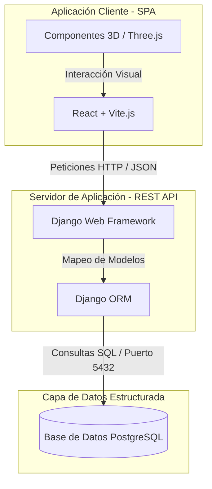
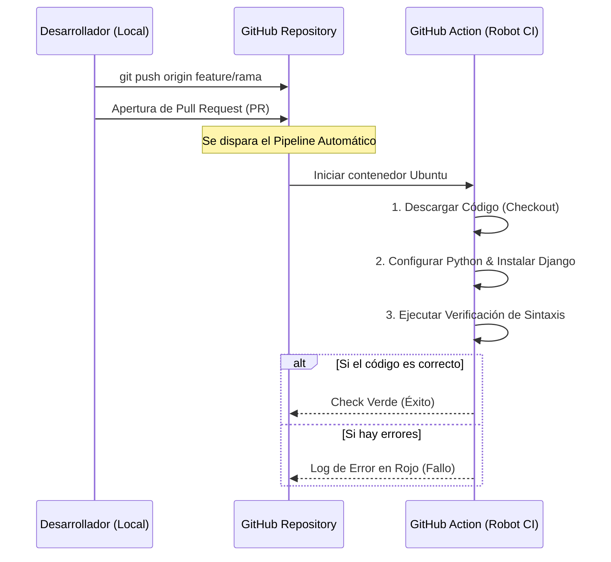

# Bandwar SGA - Sistema de Gestión de Aprendizaje enfocado en la banda de guerra de la UNEFA

Este es el repositorio central del prototipo **Bandwar SGA**, desarrollado como solución tecnológica integral para la automatización, control de inventario y gestión del conocimiento de la banda de guerra de la UNEFA-Falcon.

---

##  Arquitectura del Sistema (Doc-as-Code)

De acuerdo con los lineamientos técnicos establecidos en la Fase #2, la arquitectura estructural y el flujo de datos del sistema se encuentran modelados directamente en código utilizando **Mermaid.js**.

### 1. Diagrama de Bloques y Flujo de Datos

### 2. Flujo de Control para la Integración Continua (CI)

